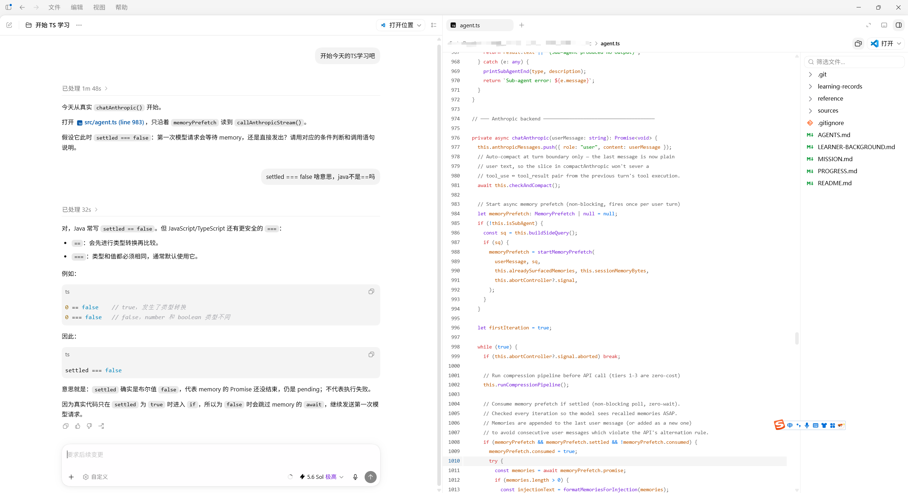
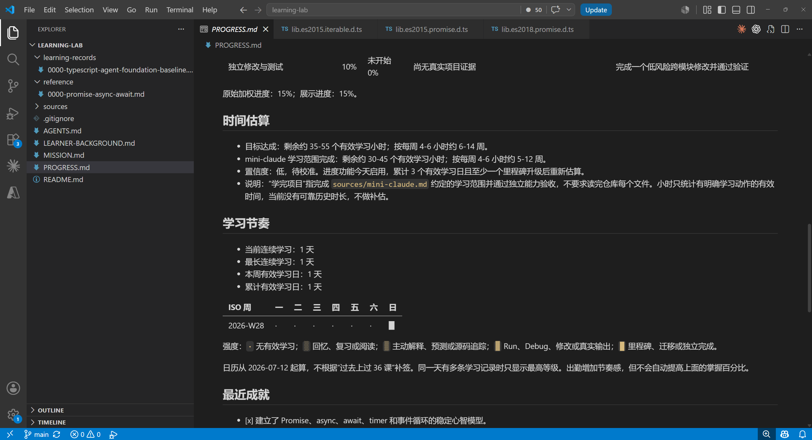
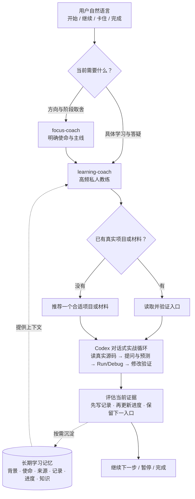

# AI Learning Coach

[](https://github.com/chrichuang218/ai-learning-coach/stargazers)
[](LICENSE)
[](https://github.com/chrichuang218/ai-learning-coach)
[](https://github.com/chrichuang218/ai-learning-coach/actions/workflows/validate.yml)

**Turn any real project into a personalized learning journey.**

**你只需要坐下来并说“开始学习”，教练负责理解你的背景、选择真实项目、找到合适入口，一次一步带你真正学会。**

<p align="center">
  
</p>

<p align="center"><sub>实时对话 + 真实源码：教练选择当前入口，用户围绕代码连续追问并建立理解。</sub></p>

<p align="center">
  
</p>

<p align="center"><sub>长期学习记忆：用 Markdown 记录掌握证据、项目进度、贡献日历和剩余时间。</sub></p>

AI Learning Coach 是一个中文优先的 Codex 私人学习教练插件。它不把课程设计责任推给用户，也不默认生成教程、HTML 课程或完整任务单，而是通过真实项目、持续对话、Run、Debug 和掌握证据动态推进学习，并用纯 Markdown 显示目标进度、项目进度、学习节奏和剩余时间。

首要服务对象是希望通过真实代码学习 TypeScript、AI Agent、源码阅读和新技术栈的开发者。相同方法也适用于写作、语言、考试、研究和职业技能。

## 快速开始

以下命令已在 Codex CLI `0.144.1` 验证：

```bash
codex plugin marketplace add chrichuang218/ai-learning-coach
codex plugin add ai-learning-coach@ai-learning-coach
```

安装后新开一个 Codex 会话，然后直接说：

```text
开始学习 TS 吧。
```

也可以让 Codex 完成同一套插件安装：

```text
帮我安装这个 Codex plugin：
https://github.com/chrichuang218/ai-learning-coach
```

从旧版升级请阅读 [MIGRATION-v2.md](MIGRATION-v2.md)。

## 它如何工作



- 用户不需要设计课程，教练负责选择入口和控制难度。
- Lesson 发生在真实项目、对话、Run 和 Debug 中，不是预生成教材。
- 文件只保存长期记忆：使命、背景、项目来源、掌握证据、进度与紧凑出勤事实、稳定知识。

## 核心体验

用户不需要先知道该学哪章、读哪个文件，甚至不一定需要提前选好项目。

```text
用户：
我是 Java 后端开发，想学 AI Agent 全栈，但还没有合适项目。

教练在后台：
读取已有背景和目标
-> 判断哪些 Java 工程经验可以迁移
-> 检索并评估真实 GitHub 项目
-> 选择一个主项目和第一个源码入口

教练对用户：
我会复用你的工程和 Debug 经验，不从编程基础重新开始。
为了确定第一个项目入口，我只确认一件事：
三个月后，你最想独立做出什么 Agent 产品？
```

下一步由用户的真实回答决定。教练掌握后台路线，但每轮只展示当前最需要的一步。

真正的学习发生在这个循环里：

```text
Codex 根据背景和真实项目给出一个当前动作
-> 用户阅读源码、预测行为
-> 在真实项目中 Run、Debug 或做低风险修改
-> 把输出、断点状态、报错和理解发回 Codex
-> Codex 解释差异、纠正误区并给出下一步
-> 形成证据后更新 learning record 和 progress
```

## 为什么不一样

| 常见 AI 学习助手 | AI Learning Coach |
| --- | --- |
| 让用户先选章节、文件和知识点 | 读取背景和真实材料，由教练选择最近发展区 |
| 一次生成完整路线和任务单 | 后台掌握路线，前台一次只给一个动作 |
| 主要输出教程、讲义和示例 | 优先使用真实项目、作品、题目和现实任务 |
| 用户说“懂了”就进入下一章 | 使用解释、预测、操作和迁移证据判断掌握 |
| 没有项目就给一串热门链接 | 比较候选仓库并推荐一个适合用户的主项目 |
| Lesson 是一份课程文件 | Lesson 是实时对话、实践和反馈过程 |

这不是一条更长的 prompt，而是一套包含职责边界、长期记忆、真实项目选择、动态教学和行为评估的 Skill 系统。

## 一个插件，两个教练

用户只安装一个插件，不需要提前判断该调用哪个 Skill。Codex 根据当前请求自动路由。

| Skill | 职责 | 不负责 |
| --- | --- | --- |
| `learning-coach` | 高频现场私教：主动备课、选择项目、源码带读、连续答疑、Run/Debug、证据记录 | 多目标战略取舍 |
| `focus-coach` | 低频战略教练：为什么学、当前主线、最大约束、继续/暂停/转向 | 逐行教学、练习设计、源码带读 |

```text
开始学、继续学、这行没懂、怎么 Debug、学完了
  -> learning-coach

方向太多、先学什么、是否值得继续、本周唯一主线
  -> focus-coach
```

## 真实项目优先

用户已有项目时，教练先验证项目路径、运行方式、技术栈和源码入口。项目合适就直接使用，不会因为另一个仓库 Star 更高而擅自替换。

用户没有项目时，教练会使用当前可验证的 GitHub 数据比较候选仓库。Star 只用于发现候选，最终还要判断：

- 是否匹配用户目标和已有技术栈。
- 代码结构和规模是否适合阅读。
- 文档、测试和本地运行是否完整。
- 项目是否仍在维护。
- License、密钥、成本和平台限制。

默认推荐一个主项目，而不是把十几个链接交给用户筛选。项目源码保留在正常开发目录，学习工作区只在 `sources/<project>.md` 中登记入口和选择依据。

遇到真实卡点时，先使用项目自己的测试、Run、Debug、日志或可逆修改。只有这些方式仍无法隔离机制时，才创建一次性临时实验；解决后立即回到真实项目，稳定结论进入 `reference/`，个人证据进入 `learning-records/`。不会建立长期练习目录体系。

## 真正的 Lesson

Lesson 默认不是一份文件。

```text
真实项目 + 对话 + Run/Debug + 回答 + 即时反馈 = Lesson
```

只有辅导需要跨时间恢复，或教学设计本身值得复用时，才保存简短 Markdown 教练 brief。它服务教练连续性，不是用户首次学习入口。

完整定义见 [LESSONS.md](plugins/ai-learning-coach/skills/learning-coach/LESSONS.md)。

## 长期学习工作区

工作区是可选的长期记忆，不是使用插件的前提。一次短答疑可以完全不创建工作区。

用户可以直接说：

```text
帮我创建一个长期学习工作区，然后开始学习 AI Agent。
```

路径能够从当前 workspace 或本地规则确定时，教练会创建最小可用文件；无法安全判断时只确认一次放置位置。不会要求用户设计目录，也不会预生成整套空目录。

```text
learning-workspace/
  README.md
  MISSION.md
  PROGRESS.md               # 需要长期感知进度时创建
  LEARNER-BACKGROUND.md     # 已有稳定背景时创建
  sources/                  # 选定真实材料时创建
  learning-records/         # 出现掌握证据时创建
  reference/                # 形成稳定知识时创建
  lessons/                  # 可选教练 brief
```

主要产物流转：

```text
MISSION.md + sources/
目标和项目学习范围
        ↓
实时对话 + 真实项目
        ├──────────→ PROGRESS.md
        │            最近活动与贡献日历
        ↓
learning-records/
个人掌握证据、误区、纠正和下一入口
        ├──────────→ PROGRESS.md
        │            目标/项目进度、ETA
        ↓
reference/*.md
稳定、去个人化、可复用的知识
        ↓ 可选
Obsidian / LLM Wiki / Notion / 其他知识系统
```

外部知识库是可选消费者，不是学习闭环的依赖。

## 看得见的进度

长期学习工作区可以维护一份根目录 `PROGRESS.md`：

```text
目标能力       [###########---------] 55%
项目学习范围   [###-----------------] 15%

当前连续学习：1 天
本周有效学习日：1 天
目标剩余估算：35-55 个有效学习小时，低置信度
```

贡献日历使用纯 Markdown 表格，保留类似 GitHub 的持续感，但不把打卡冒充掌握：

| ISO 周 | 一 | 二 | 三 | 四 | 五 | 六 | 日 |
| --- | --- | --- | --- | --- | --- | --- | --- |
| 2026-W28 | · | · | · | · | · | · | █ |

`░` 表示回忆或阅读，`▒` 表示主动解释或源码追踪，`▓` 表示 Run、Debug 或修改，`█` 表示里程碑、迁移或独立完成。同一天只取最高等级。

- 目标进度来自 `MISSION.md` 的能力与完成标准。
- 项目进度来自 `sources/<project>.md` 约定的学习范围，不要求读完所有文件。
- 掌握百分比只由 learning record 中的真实证据推动；只有低强度出勤时直接更新 `PROGRESS.md` 的最近活动、连续学习和日历，不伪造 learning record。
- ETA 始终显示区间、每周节奏假设和置信度，数据不足时明确标记待校准。

完整协议见 [PROGRESS-FORMAT.md](plugins/ai-learning-coach/skills/learning-coach/PROGRESS-FORMAT.md)。

## 你可以直接这样说

```text
继续昨天的源码。
```

```text
这段 await 为什么暂停函数却不卡线程？
```

```text
还是没懂，换一种方式讲。
```

```text
学完了，把我学会 Debug 也记录下来。
```

```text
更新一下我的目标进度、项目进度和连续学习，我按现在节奏还要多久？
```

```text
我想学 AI Agent 全栈，但没有项目。请从 GitHub 推荐一个适合我的项目并直接带我开始。
```

```text
我同时想学 TS、算法和多 Agent，这个月到底先做哪个？
```

更多请求见 [examples/prompts.md](examples/prompts.md)，技术学习响应见 [examples/sample-outputs.md](examples/sample-outputs.md)，跨领域响应见 [examples/cross-domain-sample-outputs.md](examples/cross-domain-sample-outputs.md)。

## 设计文档

- [COACHING-MODES.md](plugins/ai-learning-coach/skills/learning-coach/COACHING-MODES.md)：错误驱动、预测观察、反向教学、迁移和高压演练。
- [LEARNING-SCIENCE.md](plugins/ai-learning-coach/skills/learning-coach/LEARNING-SCIENCE.md)：主动回忆、间隔复习、交错练习和真实反馈。
- [WORKSPACE-FORMAT.md](plugins/ai-learning-coach/skills/learning-coach/WORKSPACE-FORMAT.md)：学习工作区发现、创建和写入规则。
- [LEARNER-BACKGROUND-FORMAT.md](plugins/ai-learning-coach/skills/learning-coach/LEARNER-BACKGROUND-FORMAT.md)：已确认背景、临时假设和能力边界。
- [LEARNING-RECORD-FORMAT.md](plugins/ai-learning-coach/skills/learning-coach/LEARNING-RECORD-FORMAT.md)：个人掌握证据和下一入口。
- [PROGRESS-FORMAT.md](plugins/ai-learning-coach/skills/learning-coach/PROGRESS-FORMAT.md)：证据驱动的目标进度、项目进度、贡献日历和 ETA。
- [RESOURCES-FORMAT.md](plugins/ai-learning-coach/skills/learning-coach/RESOURCES-FORMAT.md)：GitHub 项目选择和来源登记。
- [REFERENCE-FORMAT.md](plugins/ai-learning-coach/skills/learning-coach/REFERENCE-FORMAT.md)：稳定知识和可选 Wiki 流转。
- [MISSION-FORMAT.md](plugins/ai-learning-coach/skills/learning-coach/MISSION-FORMAT.md)：现实目标和完成证据。
- [TRACKS-FORMAT.md](plugins/ai-learning-coach/skills/learning-coach/TRACKS-FORMAT.md)：多轨道工作区。
- [GLOSSARY-FORMAT.md](plugins/ai-learning-coach/skills/learning-coach/GLOSSARY-FORMAT.md)：已掌握术语和共同语言。

示例工作区见 [examples/workspaces/minimal-multitrack](examples/workspaces/minimal-multitrack)。

## 开发与验证

仓库采用标准 Codex marketplace 结构，两个 Skill 只在插件内维护一份：

```text
.agents/plugins/marketplace.json
plugins/ai-learning-coach/
  .codex-plugin/plugin.json
  skills/
    learning-coach/
    focus-coach/
```

运行静态仓库校验：

```bash
python -m pip install pyyaml
python scripts/validate_repo.py
```

本地 marketplace 安装冒烟：

```bash
codex plugin marketplace add /absolute/path/to/ai-learning-coach
codex plugin list --json --marketplace ai-learning-coach --available
codex plugin add ai-learning-coach@ai-learning-coach
```

也可以运行隔离 `CODEX_HOME` 的自动安装冒烟，它不会修改当前用户的插件配置：

```bash
python scripts/release_smoke.py
```

行为验证：

- [evals/learning-coach-smoke-prompts.md](evals/learning-coach-smoke-prompts.md)
- [evals/cross-domain-smoke-prompts.md](evals/cross-domain-smoke-prompts.md)
- [evals/learning-coach-rubric.md](evals/learning-coach-rubric.md)
- [evals/focus-coach-smoke-prompts.md](evals/focus-coach-smoke-prompts.md)
- [evals/release-checklist.md](evals/release-checklist.md)
- [evals/focus-coach-rubric.md](evals/focus-coach-rubric.md)

项目演进见 [CHANGELOG.md](CHANGELOG.md)。

## 贡献

最有价值的贡献是现实中的 Skill 失败案例：错误触发、错误路由、让用户承担课程设计、忽略真实项目、解释没有改变心智模型，或者某个领域缺少合适反馈机制。

仓库提供 Issue 表单、PR 模板和自动校验。完整说明见 [CONTRIBUTING.md](CONTRIBUTING.md)。

## 致谢

本项目受到 Matt Pocock 的 [`teach` Skill](https://github.com/mattpocock/skills/blob/main/skills/productivity/teach/SKILL.md) 启发，并根据真实长期学习中的反馈重构为“私人教练主动备课 + 实时对话带学 + 证据沉淀”的模式。

感谢 [LINUX DO](https://linux.do/) 社区的支持与讨论。

## 许可证

MIT
